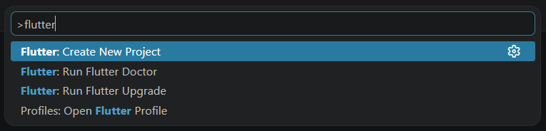
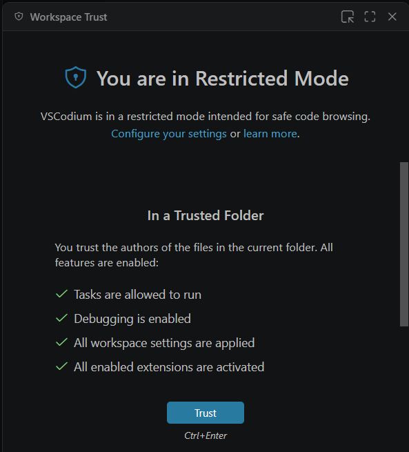
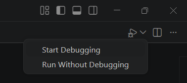

# Create a Flutter Project  

This chapter covers the basics of creating a new Flutter project. It is based on the use of VS Code.  
If you prefer Android Studio or Intellij, you can refer to the official documentation from Flutter: [https://docs.flutter.dev/install/custom#editor](https://docs.flutter.dev/install/custom#editor)

## Create a new empty project
  1. Open the command palette in VS Code.
      
      Go to **View** > **Command Palette** or press **Control** + **Shift** + **P**.
      
  2. In the command palette, type `flutter`.
  3. Select **Flutter: New Project**.
   

  4. Select **Empty Application**.
   
  5. Choose the folder where you want to create the new project.
   
  6. Choose how you want to name the project. You can use `ghibli_viewer` or something else.
   
  7. Select platforms
      - android
      - web
      - (optional) any other platforms  
  

  8. Wait for the project to initialize.  
    VS Code uses flutter create to bootstrap your app.
   
   
      #@todo, toggle for image and smaller image
    If needed, set the folder as a `Trusted Folder`. The project creation is blocked in `Restricted Mode`.
   
   

## Run the project
  1. Open the `/lib/main.dart` file.
  2. On the top right of the VSCode interface, the `Start Debugging` option should appear. Click it to run the project.
   
  3. If you need to change the device that your project launches on:   
      - In the command palette, type `flutter`.  
      - Select **Flutter: Select Device**.
  4. You should now see the default empty Flutter project in your Android Emulator or web browser:
   

## References
- [https://docs.flutter.dev/install/quick#test-drive](https://docs.flutter.dev/install/quick#test-drive)
