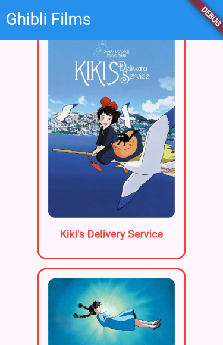
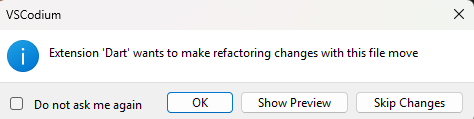
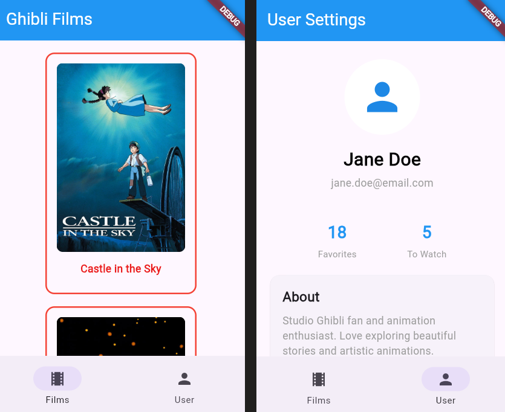

# MVVM: View

## Learning Outcome

By the end of this chapter, you'll understand how Views serve as page-level components in the MVVM architecture, create a `FilmsView` widget that displays multiple film cards in a scrollable list, and organize your project structure to separate concerns by feature (views and their widgets).

## Theory / Explanation

As your application grows, managing all state, logic, and UI in one place becomes difficult.  
[**Model-View-ViewModel (MVVM)**](https://docs.flutter.dev/app-architecture/guide#mvvm) is an architecture pattern that separates these concerns into distinct layers. Let's start with the **View** layer.  
MVVM is one way amongst others to achieve a [**Layered Architecture**](https://docs.flutter.dev/app-architecture/concepts#layered-architecture)

### The View Layer

For now, think of Views like pages in your application. Each page/route typically has its own View. When users navigate to different parts of your app, they're moving between different Views.

### The FilmsView

Currently, we have a `FilmCard()` that is being called directly from our root widget `MainApp()`.  
Our final goal is to display all the films that are returned by the ghibli api. We will now create `FilmsView()` the widget that represent a page in our application, and will display a list of `FilmCard()`.

Your `FilmsView` will:
- Use [`Scaffold`](https://api.flutter.dev/flutter/material/Scaffold-class.html) to provide the page structure (app bar, body).
- Display multiple `FilmCard` widgets in a scrollable [`ListView`](https://api.flutter.dev/flutter/widgets/ListView-class.html)
- Receive a list of `Film` as an input.

This View will later receive data from a ViewModel, but for now, we will pass a list of `Film` passed by the `MainApp()` widget.

## Practice

### Exercise 1: Create FilmsView and Display in Main

Create a `FilmsView` widget that extends `StatelessWidget` and update your `main.dart` to use it.


**Steps:**
- Create `lib/views/films_view.dart`
- Define `FilmsView` class extending `StatelessWidget`
- Have the `FilmsView()` return a simple `Text("Hello from FilmsView")`
- Update `main.dart` to import and use `FilmsView()` as the home screen
- Wrap the "Hello from FilmsView" widget with [`Scaffold`](https://api.flutter.dev/flutter/material/Scaffold-class.html) and add an [`appBar property`](https://api.flutter.dev/flutter/material/Scaffold/appBar.html) with:
  - title
  - foreground color
  - background color  

`Scaffold` is used to implement a basic layout, the main content of the page is passed with the [`body`](https://api.flutter.dev/flutter/material/Scaffold/body.html) property.


<details>
<summary>Solution</summary>

```dart
// lib/views/films_view.dart
import 'package:flutter/material.dart';

class FilmsView extends StatelessWidget {
  const FilmsView({super.key});

  @override
  Widget build(BuildContext context) {
    return Scaffold(
      appBar: AppBar(
        title: Text("Ghibli Films"),
        backgroundColor: Colors.blue,
        foregroundColor: Colors.white,
      ),
      body: Center(child: Text("Hello from FilmsView")),
    );
  }
}
```

```dart
// lib/main.dart
import 'package:flutter/material.dart';
import 'package:ghibli_viewer_lab/views/films_view.dart';

void main() {
  runApp(const MainApp());
}

class MainApp extends StatelessWidget {
  const MainApp({super.key});

  @override
  Widget build(BuildContext context) {
    return MaterialApp(
      home: Scaffold(body: Center(child: FilmsView())),
    );
  }
}


```

</details>

### Exercise 2: Add Mock Films Data and Display with ListView

Create a static `mockFilms` list with film data and display them using a scrollable list.


**Steps:**
- In the `MainApp()` add the following variable: 
  ```dart
   static const mockFilms = [
      Film(
        id: 'ea660b10-85c4-4ae3-8a5f-41cea3648e3e',
        title: "Kiki's Delivery Service",
        originalTitle: '魔女の宅急便',
        originalTitleRomanised: 'Majo no takkyūbin',
        image: 'https://image.tmdb.org/t/p/w600_and_h900_bestv2/7nO5DUMnGUuXrA4r2h6ESOKQRrx.jpg',
        movieBanner:
            'https://image.tmdb.org/t/p/original/h5pAEVma835u8xoE60kmLVopLct.jpg',
        description: 'A young witch, on her mandatory year of independent life, finds fitting into a new community difficult while she supports herself by running an air courier service.',
        director: 'Hayao Miyazaki',
        producer: 'Hayao Miyazaki',
        releaseDate: '1989',
        runningTime: '102',
        rtScore: '96',
        people: [
          'https://ghibliapi.vercel.app/people/2409052a-9029-4e8d-bfaf-70fd82c8e48d',
          'https://ghibliapi.vercel.app/people/7151abc6-1a9e-4e6a-9711-ddb50ea572ec',
        ],
        species: [
          'https://ghibliapi.vercel.app/species/af3910a6-429f-4c74-9ad5-dfe1c4aa04f2',
        ],
        locations: ['https://ghibliapi.vercel.app/locations/'],
        vehicles: ['https://ghibliapi.vercel.app/vehicles/'],
        url: 'https://ghibliapi.vercel.app/films/ea660b10-85c4-4ae3-8a5f-41cea3648e3e',
      ),
      Film(
        id: '2baf70d1-42bb-4437-b551-e5fed5a87abe',
        title: 'Castle in the Sky',
        originalTitle: '天空の城ラピュタ',
        originalTitleRomanised: 'Tenkū no shiro Rapyuta',
        image: 'https://image.tmdb.org/t/p/w600_and_h900_bestv2/npOnzAbLh6VOIu3naU5QaEcTepo.jpg',
        movieBanner: 'https://image.tmdb.org/t/p/w533_and_h300_bestv2/3cyjYtLWCBE1uvWINHFsFnE8LUK.jpg',
        description: 'The orphan Sheeta inherited a mysterious crystal that links her to the mythical sky-kingdom of Laputa. With the help of resourceful Pazu and a rollicking band of sky pirates, she makes her way to the ruins of the once-great civilization. Sheeta and Pazu must outwit the evil Muska, who plans to use Laputa\'s science to make himself ruler of the world.',
        director: 'Hayao Miyazaki',
        producer: 'Isao Takahata',
        releaseDate: '1986',
        runningTime: '124',
        rtScore: '95',
        people: [
          'https://ghibliapi.vercel.app/people/598f7048-74ff-41e0-92ef-87dc1ad980a9',
          'https://ghibliapi.vercel.app/people/fe93adf2-2f3a-4ec4-9f68-5422f1b87c01',
          'https://ghibliapi.vercel.app/people/3bc0b41e-3569-4d20-ae73-2da329bf0786',
          'https://ghibliapi.vercel.app/people/40c005ce-3725-4f15-8409-3e1b1b14b583',
          'https://ghibliapi.vercel.app/people/5c83c12a-62d5-4e92-8672-33ac76ae1fa0',
          'https://ghibliapi.vercel.app/people/e08880d0-6938-44f3-b179-81947e7873fc',
          'https://ghibliapi.vercel.app/people/2a1dad70-802a-459d-8cc2-4ebd8821248b',
        ],
        species: [
          'https://ghibliapi.vercel.app/species/af3910a6-429f-4c74-9ad5-dfe1c4aa04f2',
        ],
        locations: ['https://ghibliapi.vercel.app/locations/'],
        vehicles: [
          'https://ghibliapi.vercel.app/vehicles/4e09b023-f650-4747-9ab9-eacf14540cfb',
        ],
        url: 'https://ghibliapi.vercel.app/films/2baf70d1-42bb-4437-b551-e5fed5a87abe',
      ),
    ];
  ```  

- Adapt `FilmsView()` to receive a list of films property
- Use [`ListView.builder`](https://api.flutter.dev/flutter/widgets/ListView/ListView.builder.html) in the Scaffold body to render the films

<details>
<summary>Hints</summary>

[`ListView.builder`](https://api.flutter.dev/flutter/widgets/ListView-class.html) efficiently renders a scrollable list of items:

```dart
ListView.builder(
  itemCount: items.length,
  itemBuilder: (context, index) {
    return SomeWidget(item: items[index]);
  },
)
```

The `itemBuilder` function is called for each item and should return the widget to display.

**Note:** You could also use a `Column` with a for-loop inside `ListView` or `SingleChildScrollView`, but `ListView.builder` is more efficient, especially for large lists, because it only builds widgets that are visible on screen.

</details>

<details>
<summary>Solution</summary>

```dart
// lib/views/films_view.dart
import 'package:flutter/material.dart';
import 'package:ghibli_viewer_lab/models/film_model.dart';
import 'package:ghibli_viewer_lab/views/film_card.dart';

class FilmsView extends StatelessWidget {
  const FilmsView({super.key, required this.films});

  final List<Film> films;

  @override
  Widget build(BuildContext context) {
    return Scaffold(
      appBar: AppBar(
        title: const Text("Ghibli Films"),
        backgroundColor: Colors.blue,
        foregroundColor: Colors.white,
      ),
      body: ListView.builder(
        itemCount: films.length,
        itemBuilder: (context, index) {
          return Center(
            child: Padding(
              padding: const EdgeInsets.symmetric(vertical: 6),
              child: FilmCard(film: films[index]),
            ),
          );
        },
      ),
    );
  }
}

```

</details>

### Exercise 3: Organize Project File Structure

As your project grows, organizing files by feature (rather than by type) keeps the codebase tidy and makes it easier to find related code. A `films` folder containing all film-related views and widgets keeps everything together, making future changes and additions much simpler.

**Steps:**
- Create `lib/views/films/` directory
- Move all film related widget files to `lib/views/films/`
- Then create `lib/views/films/widgets/` subdirectory
- Move all film widgets, except the View, to `lib/views/films/widgets/`

- Update all imports, this can be done automatically by the IDE:  

  


**Final expected structure:**
```
lib/
├── models/
│   └── film_model.dart
├── views/
│   └── films/
│       ├── films_view.dart
│       └── widgets/
│           ├── film_card.dart
│           ├── film_details.dart
│           └── film_title.dart
└── main.dart
```

## Recap

- ✓ Understood the role of Views in MVVM architecture (page-level components)
- ✓ Learned the distinction between Views and individual widgets
- ✓ Created `FilmsView` to display multiple films in a grid or list
- ✓ Practiced organizing project structure by feature (`lib/views/films/`)
- ✓ Prepared the View layer to receive data from a ViewModel

## More About Views

Most applications have more than one View and a navigation system to switch from one View to another.  
Navigation will not be covered in this lab, but to illustrate the concept, here are screenshots of the Ghibli Viewer with a user View and navigation. The navigation is implemented with the Flutter package GoRouter and the UserView is widget that, like FilmsView, uses Scaffold to display the top banner with the name of the current page (or View):



## Next Steps

The View is what users interact with, but it needs data and logic. The next chapter introduces the **ViewModel layer** which will manage the state and orchestrate fetching films from the Model layer, then the View will display them.
