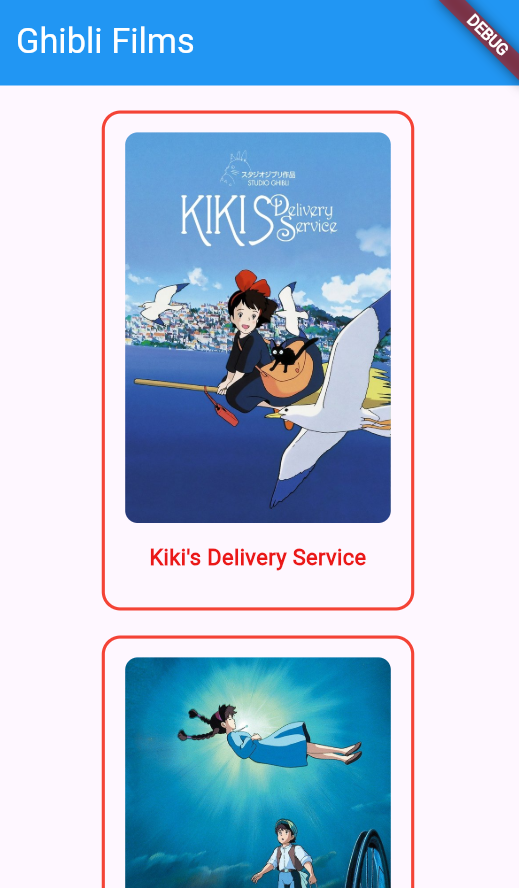
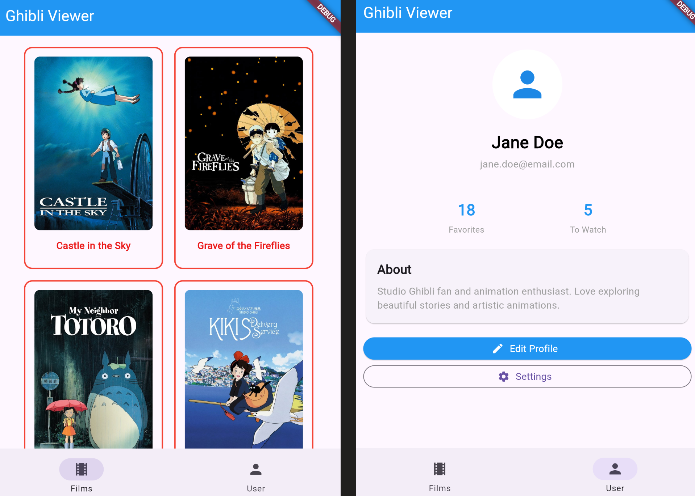

# MVVM: View

As your application grows, managing all state, logic, and UI in one place becomes difficult.  
[**Model-View-ViewModel (MVVM)**](https://docs.flutter.dev/app-architecture/guide#mvvm) is an architecture pattern that separates these concerns into distinct layers. Let's start with the **View** layer.  
MVVM is one way amongst others to achieve a [**Layered Architecture**](https://docs.flutter.dev/app-architecture/concepts#layered-architecture)

## The View Layer

Think of Views like pages in your application. Each page/route typically has its own View. When users navigate to different parts of your app, they're moving between different Views.


## The FilmsView

Currently, we have a `FilmCard()` that is being called directly from our root widget `MainApp()`.  
Our final goal is to display all the films that are returned by the ghibli api. We will now create `FilmView()` the widget that represent a page in our application, and will display a list of `FilmCard()`.

Your `FilmsView` will:
- Use `Scaffold` to provide the page structure (app bar, body)
- Display multiple `FilmCard` widgets in a grid or list

This View will later receive data from a ViewModel, but for now, you can pass sample `Film` objects.

## Practice

1. **Create a FilmsView widget** that extends `StatelessWidget`

   - Use `Scaffold` with an `appBar` showing "Ghibli Films"
   - FilmsView receives an array of `Film()`
      You can use:
      ```dart
        static const mockFilms = [
            Film(
              id: 'ea660b10-85c4-4ae3-8a5f-41cea3648e3e',
              title: "Kiki's Delivery Service",
              originalTitle: '魔女の宅急便',
              originalTitleRomanised: 'Majo no takkyūbin',
              image: 'https://image.tmdb.org/t/p/w600_and_h900_bestv2/7nO5DUMnGUuXrA4r2h6ESOKQRrx.jpg',
              movieBanner:
                  'https://image.tmdb.org/t/p/original/h5pAEVma835u8xoE60kmLVopLct.jpg',
              description: 'A young witch, on her mandatory year of independent life, finds fitting into a new community difficult while she supports herself by running an air courier service.',
              director: 'Hayao Miyazaki',
              producer: 'Hayao Miyazaki',
              releaseDate: '1989',
              runningTime: '102',
              rtScore: '96',
              people: [
                'https://ghibliapi.vercel.app/people/2409052a-9029-4e8d-bfaf-70fd82c8e48d',
                'https://ghibliapi.vercel.app/people/7151abc6-1a9e-4e6a-9711-ddb50ea572ec',
              ],
              species: [
                'https://ghibliapi.vercel.app/species/af3910a6-429f-4c74-9ad5-dfe1c4aa04f2',
              ],
              locations: ['https://ghibliapi.vercel.app/locations/'],
              vehicles: ['https://ghibliapi.vercel.app/vehicles/'],
              url: 'https://ghibliapi.vercel.app/films/ea660b10-85c4-4ae3-8a5f-41cea3648e3e',
            ),
            Film(
              id: '2baf70d1-42bb-4437-b551-e5fed5a87abe',
              title: 'Castle in the Sky',
              originalTitle: '天空の城ラピュタ',
              originalTitleRomanised: 'Tenkū no shiro Rapyuta',
              image: 'https://image.tmdb.org/t/p/w600_and_h900_bestv2/npOnzAbLh6VOIu3naU5QaEcTepo.jpg',
              movieBanner: 'https://image.tmdb.org/t/p/w533_and_h300_bestv2/3cyjYtLWCBE1uvWINHFsFnE8LUK.jpg',
              description: 'The orphan Sheeta inherited a mysterious crystal that links her to the mythical sky-kingdom of Laputa. With the help of resourceful Pazu and a rollicking band of sky pirates, she makes her way to the ruins of the once-great civilization. Sheeta and Pazu must outwit the evil Muska, who plans to use Laputa\'s science to make himself ruler of the world.',
              director: 'Hayao Miyazaki',
              producer: 'Isao Takahata',
              releaseDate: '1986',
              runningTime: '124',
              rtScore: '95',
              people: [
                'https://ghibliapi.vercel.app/people/598f7048-74ff-41e0-92ef-87dc1ad980a9',
                'https://ghibliapi.vercel.app/people/fe93adf2-2f3a-4ec4-9f68-5422f1b87c01',
                'https://ghibliapi.vercel.app/people/3bc0b41e-3569-4d20-ae73-2da329bf0786',
                'https://ghibliapi.vercel.app/people/40c005ce-3725-4f15-8409-3e1b1b14b583',
                'https://ghibliapi.vercel.app/people/5c83c12a-62d5-4e92-8672-33ac76ae1fa0',
                'https://ghibliapi.vercel.app/people/e08880d0-6938-44f3-b179-81947e7873fc',
                'https://ghibliapi.vercel.app/people/2a1dad70-802a-459d-8cc2-4ebd8821248b',
              ],
              species: [
                'https://ghibliapi.vercel.app/species/af3910a6-429f-4c74-9ad5-dfe1c4aa04f2',
              ],
              locations: ['https://ghibliapi.vercel.app/locations/'],
              vehicles: [
                'https://ghibliapi.vercel.app/vehicles/4e09b023-f650-4747-9ab9-eacf14540cfb',
              ],
              url: 'https://ghibliapi.vercel.app/films/2baf70d1-42bb-4437-b551-e5fed5a87abe',
            ),
          ];
      ```
   - Use a `GridView` or `ListView` to display multiple `FilmCard` widgets
2. Reorganize the file structure:  
   - In `lib/views` create a `/films` folder and move all widgets related to films to this folder
   - Optionally, you can also create the `lib/views/films/widgets` folder and add to it:
      - `film_card.dart`
      - `film_title.dart`
      - `film_details.dart`
   - The resulting file structure indicate clearly that we have a view dedicated to films, and that `FilmsView()` is the root node, or root widget, for this section of our app.

  ```
  │   main.dart
  │   
  ├───models
  │       film_model.dart
  │       
  └───views
      └───films
          │   film_view.dart
          │   
          └───widgets
                  film_card.dart
                  film_details.dart
                  film_title.dart
  ```




## More about Views
Most application have more than one View and a navigation system to switch from one View to another.  
Navigation will not be covered in this lab, but to illustrate the concept, here are screenshots of a the Ghibli Viewer with a user View and navigation. The navigation is implemented with the Flutter package GoRouter and the UserView is widget that, like FilmsView, uses Scaffold to display the top banner with the name of the current page (or View):



## Next Steps

The View is what users interact with, but it needs data and logic. The next chapters will introduce the ViewModel and Model layers to complete the MVVM pattern.
