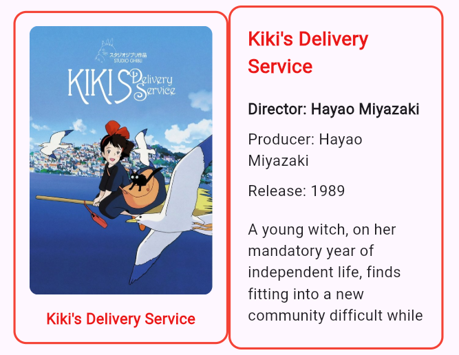

# MVVM: ViewModel

The **ViewModel** is the bridge between your View and your data. It holds the state (data) that your View needs to display. 

If a stateful widget has a state, a View has a ViewModel that holds all its states and for all the View's widget to access. ?

## What Does Logic Mean?

The ViewModel holds **state** and manages **user interactions**:
- **State**: Data the View needs (a list of films, loading status, error messages)
- **User Interactions**: Methods that respond to user actions (like "fetchFilms" button taps)


## ChangeNotifier: Managing State Changes

Flutter provides a class called `ChangeNotifier` that makes it easy to notify widgets when state changes:
- Your ViewModel extends `ChangeNotifier`
- When state changes, call `notifyListeners()` to alert all watching widgets
- Watching widgets rebuild automatically with the new state


## The Provider Package

**Provider** is a popular package for dependency injection and state management. It makes it easy to:
- Create instances of your ViewModels
- Share them across your widget tree
- Have widgets listen to ViewModel state changes

After running `flutter pub add provider`, you can import it:
```dart
import 'package:provider/provider.dart';
```

## Using Consumer to Listen to State

The `Consumer` widget rebuilds whenever the ViewModel notifies listeners:
- Wrap your UI with a `Consumer<YourViewModel>`
- Access the ViewModel instance inside the Consumer
- When the ViewModel's state changes, only the Consumer rebuilds (efficient!)


## Practice

1. **Create a FilmsViewModel** that extends `ChangeNotifier`
   - Add a list property to store films: `List<Film> films = []`
   - Add a method `fetchFilms()` that:
     - For now, just creates some sample Film objects and stores them in the `films` list
     - Calls `notifyListeners()` at the end to alert watching widgets
   
2. **Add the provider dependency**
   - Run `flutter pub add provider` in your terminal
   - Verify it was added to `pubspec.yaml`

3. **Update your FilmsView to use Provider**
   - Wrap your film list with `Consumer<FilmsViewModel>()`
   - Inside the Consumer, access the ViewModel and display `viewModel.films`
   - If the films list is empty, show a message like "No films yet"

4. **Add a "Fetch Films" button**
   - Add a button in the app bar or body
   - When tapped, call `viewModel.fetchFilms()`
   - The Consumer rebuilds automatically with the new films



## Next Steps

So far, `fetchFilms()` just creates sample data. In the next chapter, we'll connect this to the real Ghibli API to fetch actual film data.  
