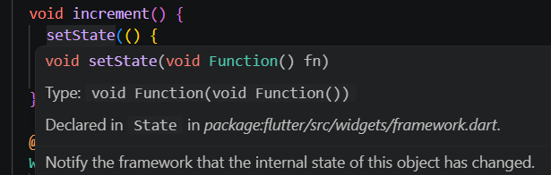
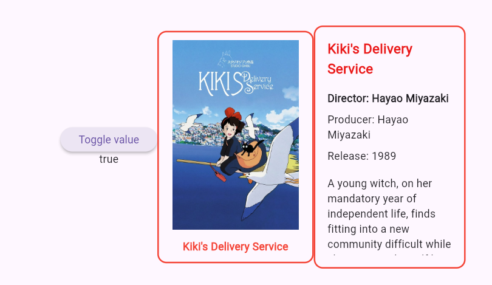
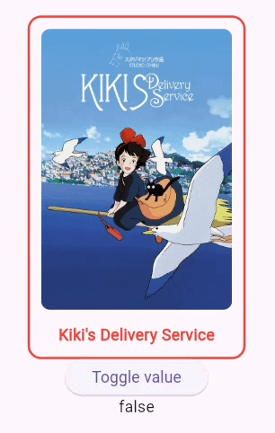

# Stateful Widgets

## Learning Outcome

By the end of this chapter, you'll understand how to create stateful widgets, manage ephemeral state with `setState()`, and build an interactive `FilmCard` widget that toggles between showing film title/image and detailed information when tapped.

## Theory / Explanation

So far, all our widgets have been `StatelessWidget` because they don't need to change after they are created. But interactive applications need widgets that can change their appearance based on user actions. That's where `StatefulWidget` comes in.

## What is State?

**State** is data that can change during the lifetime of a widget. Examples include:
- Whether a button has been pressed
- Whether a menu is open or closed
- Whether a film's details are showing or hidden  


**React** has `useState()`, **Vue** usually uses `Ref()`, **Angular** has `signals()` and **Flutter** uses `StatefulWidget`

When state changes, the widget rebuilds to reflect the new state on screen. This automatic re-rendering of the UI is the concept of **declarative programming**.

## Ephemeral State vs App State

Not all state is the same:
- **Ephemeral state** (or UI state) affects only one widget and is temporary. Examples: whether a dropdown is expanded, whether a film's details are showing. This state doesn't need to be saved or shared globally across the application.
- **App state** affects the entire application, or a large portion of the application, and persists. We'll cover this later with MVVM.

For now, we're focusing on **ephemeral state**, using `StatefulWidget` to manage local UI changes.

## Creating a StatefulWidget

A `StatefulWidget` is actually two classes:
1. The widget class itself (extends `StatefulWidget`)
2. A state class (extends `State<WidgetName>`)

The state class contains:
- The mutable data (properties that can change)
- The `build()` method that describes the UI
- Methods to modify the state (using `setState()`)

## Managing State with setState()

When you need to change state and update the UI, you call `setState()`:
- Pass a **function** that updates your state variables
- Flutter rebuilds the widget automatically
- The screen displays the new state

## Example: A Simple Counter

Here's a basic `StatefulWidget` that increments a counter when a button is tapped:

```dart
class Counter extends StatefulWidget {
  const Counter({super.key});

  @override
  State<Counter> createState() => _CounterState();
}

class _CounterState extends State<Counter> {
  int count = 0;

  void increment() {
    setState(() {
      count++;
    });
  }

  @override
  Widget build(BuildContext context) {
    return Column(
      mainAxisAlignment: MainAxisAlignment.center,
      children: [
        Text('Count: $count'),
        ElevatedButton(
          onPressed: increment, 
          child: const Text('Increment')
        ),
      ],
    );
  }
}
```

Notice:
- The widget class (`Counter`) is simple and just creates the state
- The state class (`_CounterState`) holds the mutable `count` variable
- When the ElevatedButton is pressed, the function `increment()` is called. Note that `onPressed: increment,` does not use parentheses at the end of increment. `onPressed` expects a reference to a function.
- Note the syntax of `setState()` call inside of `increment()`. `setState()` expects a function as parameter. 
  
- Here we are using the [anonymous function](https://dart.dev/language/functions#anonymous-functions) syntax from Dart, which is very similar to arrow functions from JavaScript:
  ```dart
    setState(() {
      count++;
    });
  ```

`int count = 0;` looks like a normal variable, but since it is defined in `class _CounterState extends State<Counter>` it is actually a state. In this regard, Flutter syntax differs from other frameworks like React that relies on the `useState()` syntax to create a state. We can compare a `StatelessWidget()` to a React component that has no `useState()` and a `StatefulWidget()` would be the equivalent of a React component with a `useState()`.
This count state should only be modified inside a setState() call; otherwise, the value will change in memory, but the UI will not update to reflect it.


## Practice

Create a `FilmCard` widget that combines `FilmTitle()` and `FilmDetails()`:

### Exercise 1: Create FilmCard as a StatefulWidget

In a new file `lib/views/film_card.dart` create `FilmCard()` a StatefulWidget that accepts a `Film` object.  
Add a boolean state variable `showDetails` (initially false).  
For now, display the value of `showDetails` in a `Text()` widget. Use `Text(showDetails.toString())` for the boolean value to be cast as String.
And display this new widget in the `MainApp()`.

<details>
<summary>Solution</summary>

```dart
// /lib/views/film_card.dart
import 'package:flutter/material.dart';

class FilmCard extends StatefulWidget {
  const FilmCard({super.key});

  @override
  State<FilmCard> createState() => _FilmCardState();
}

class _FilmCardState extends State<FilmCard> {
  bool showDetails = false;

  @override
  Widget build(BuildContext context) {
    return Text(showDetails.toString());
  }
}
```

```dart
// lib/main.dart
import 'package:flutter/material.dart';
import 'package:ghibli_viewer_lab/models/film_model.dart';
import 'package:ghibli_viewer_lab/views/film_card.dart';
import 'package:ghibli_viewer_lab/views/film_details.dart';
import 'package:ghibli_viewer_lab/views/film_title.dart';

void main() {
  runApp(const MainApp());
}

class MainApp extends StatelessWidget {
  const MainApp({super.key});

  static const mockFilm = Film(
    id: 'ea660b10-85c4-4ae3-8a5f-41cea3648e3e',
    title: "Kiki's Delivery Service",
    originalTitle: '魔女の宅急便',
    originalTitleRomanised: 'Majo no takkyūbin',
    image: 'https://image.tmdb.org/t/p/w600_and_h900_bestv2/7nO5DUMnGUuXrA4r2h6ESOKQRrx.jpg',
    movieBanner:
        'https://image.tmdb.org/t/p/original/h5pAEVma835u8xoE60kmLVopLct.jpg',
    description: 'A young witch, on her mandatory year of independent life, finds fitting into a new community difficult while she supports herself by running an air courier service.',
    director: 'Hayao Miyazaki',
    producer: 'Hayao Miyazaki',
    releaseDate: '1989',
    runningTime: '102',
    rtScore: '96',
    people: [
      'https://ghibliapi.vercel.app/people/2409052a-9029-4e8d-bfaf-70fd82c8e48d',
      'https://ghibliapi.vercel.app/people/7151abc6-1a9e-4e6a-9711-ddb50ea572ec',
    ],
    species: [
      'https://ghibliapi.vercel.app/species/af3910a6-429f-4c74-9ad5-dfe1c4aa04f2',
    ],
    locations: ['https://ghibliapi.vercel.app/locations/'],
    vehicles: ['https://ghibliapi.vercel.app/vehicles/'],
    url: 'https://ghibliapi.vercel.app/films/ea660b10-85c4-4ae3-8a5f-41cea3648e3e',
  );

  @override
  Widget build(BuildContext context) {
    return MaterialApp(
      home: Scaffold(
        body: Center(
          child: Row(
            mainAxisAlignment: MainAxisAlignment.center,
            children: [
              FilmCard(),
              const FilmTitle(film: mockFilm),
              const FilmDetails(film: mockFilm),
            ],
          ),
        ),
      ),
    );
  }
}

```

</details>

### Exercise 2: Add a button to toggle the value of the `showDetail` state


Write a function, inside the `_FilmCardState` that uses `setState()` to toggle the value of `showDetails`.  
Add an `ElevatedButton` to trigger the new state toggling function.  
Test your app to make sure clicking on the button changes the value that is being displayed.  

<details>
<summary>Solution</summary>

```dart
import 'package:flutter/material.dart';

class FilmCard extends StatefulWidget {
  const FilmCard({super.key});

  @override
  State<FilmCard> createState() => _FilmCardState();
}

class _FilmCardState extends State<FilmCard> {
  bool showDetails = false;

  void toggleShowDetails() {
    setState(() {
      showDetails = !showDetails;
    });
  }

  @override
  Widget build(BuildContext context) {
    return Column(
      mainAxisSize: MainAxisSize.min,
      children: [
        ElevatedButton(
          onPressed: toggleShowDetails,
          child: Text("Toggle value"),
        ),
        Text(showDetails.toString()),
      ],
    );
  }
}
```  

</details>

### Exercise 3: Display either `FilmTitle()` or `FilmDetails()`

Let's now add conditional rendering based on the `showDetails` boolean state.  

First you can remove `FilmTitle()` and `FilmDetails()` from the `MainApp()`. They will now be wrapped inside `FilmCard()`.  

There are multiple ways to achieve [conditional rendering](https://www.geeksforgeeks.org/flutter/flutter-outputting-widgets-conditionally/) in Flutter. The method we will use now is the [ternary operator](https://dart-tutorial.com/conditions-and-loops/ternary-operator-in-dart/), a short form for an "if-else" condition.  

The ternary operator is used to return either `FilmTitle()` or `FilmDetails()`.  

The `FilmCard()` widget must also be updated to receive a `Film` object.

<details>
<summary>Hints</summary>  

**Example of ternary operator syntax for widget rendering**  
Here is an example of ternary operator to conditionally render two different `Text()` widgets:  

```dart
  Widget build(BuildContext context) {
    return Column(
      mainAxisSize: MainAxisSize.min,
      children: [
        (showDetails ? Text("Should show details") : Text("Should show title")),
        ElevatedButton(
          onPressed: toggleShowDetails,
          child: Text("Toggle value"),
        ),
        Text(showDetails.toString()),
      ],
    );
```  

**Where to define the `film` property and how to access it**

For the `Film` attribute of the `FilmCard()` widget, since it is not a state, it should be defined as a `final` variable in `FilmCard` and not in `_FilmCardState`.

The `film` property is defined in the `FilmCard` widget (immutable), not in the state class. In `_FilmCardState`, use `widget.film` to access it because `widget` is a special property that gives the state access to its parent `StatefulWidget`. Immutable data lives on the widget, mutable state lives in the state class.

</details><br>  


<details>
<summary>Solution</summary>

```dart
import 'package:flutter/material.dart';
import 'package:ghibli_viewer_lab/models/film_model.dart';
import 'package:ghibli_viewer_lab/views/film_details.dart';
import 'package:ghibli_viewer_lab/views/film_title.dart';

class FilmCard extends StatefulWidget {
  final Film film;
  const FilmCard({super.key, required this.film});

  @override
  State<FilmCard> createState() => _FilmCardState();
}

class _FilmCardState extends State<FilmCard> {
  bool showDetails = false;

  void toggleShowDetails() {
    setState(() {
      showDetails = !showDetails;
    });
  }

  @override
  Widget build(BuildContext context) {
    return Column(
      mainAxisSize: MainAxisSize.min,
      children: [
        (showDetails
            ? FilmDetails(film: widget.film)
            : FilmTitle(film: widget.film)),
        ElevatedButton(
          onPressed: toggleShowDetails,
          child: Text("Toggle value"),
        ),
        Text(showDetails.toString()),
      ],
    );
  }
}

```  

</details>


### Exercise 4: Replace `ElevatedButton()` with `GestureDetector()`
We have the logic, but it would be nicer to be able to click the card directly to flip it.  

Remove the `ElevatedButton()` and the `Text()` that shows the boolean value.  

Then wrap the `Column()` with "widget". This can be used when the widget we want to add is not part of the selection in the refactoring tool. Replace "widget" with `GestureDetector()` and re-implement the boolean toggle for the `onTap` action.


<details>
<summary>Solution</summary>

```dart
import 'package:flutter/material.dart';
import 'package:ghibli_viewer_lab/models/film_model.dart';
import 'package:ghibli_viewer_lab/views/film_details.dart';
import 'package:ghibli_viewer_lab/views/film_title.dart';

class FilmCard extends StatefulWidget {
  final Film film;
  const FilmCard({super.key, required this.film});

  @override
  State<FilmCard> createState() => _FilmCardState();
}

class _FilmCardState extends State<FilmCard> {
  bool showDetails = false;

  void toggleShowDetails() {
    setState(() {
      showDetails = !showDetails;
    });
  }

  @override
  Widget build(BuildContext context) {
    return GestureDetector(
      onTap: toggleShowDetails,
      child: Column(
        mainAxisSize: MainAxisSize.min,
        children: [
          (showDetails
              ? FilmDetails(film: widget.film)
              : FilmTitle(film: widget.film)),
        ],
      ),
    );
  }
}
```
</details>

### Exercise 5: Add Sizing Constraints

Notice that both `FilmTitle` and `FilmDetails` have their own padding and spacing logic. We can remove this duplication by enforcing a consistent size and padding at the `FilmCard` level.

Replace the `Column` wrapper with a `Container` that specifies a fixed width, height, and padding. This way, both child widgets are constrained to the same dimensions regardless of their internal layout.

<details>
<summary>Hints</summary>

A `Container` can hold sizing and padding properties:
```dart
Container(
  width: 200,
  height: 320,
  padding: const EdgeInsets.all(12),
  child: // your conditional child here
)
```

By adding padding at the container level, you centralize size management and reduce the need for each child widget to handle its own spacing.

To remove the deprecated `Container()` widgets from `FilmTitle()` and `FilmDetails()` you can use the refactoring tool and the option **"Remove widget"**.  

</details><br>

<details>
<summary>Solution</summary>

```dart
import 'package:flutter/material.dart';
import 'package:ghibli_viewer_lab/models/film_model.dart';
import 'package:ghibli_viewer_lab/views/film_details.dart';
import 'package:ghibli_viewer_lab/views/film_title.dart';

class FilmCard extends StatefulWidget {
  final Film film;
  const FilmCard({super.key, required this.film});

  @override
  State<FilmCard> createState() => _FilmCardState();
}

class _FilmCardState extends State<FilmCard> {
  bool showDetails = false;

  @override
  Widget build(BuildContext context) {
    return GestureDetector(
      onTap: () {
        setState(() {
          showDetails = !showDetails;
        });
      },
      child: Container(
        width: 200,
        height: 320,
        padding: const EdgeInsets.all(12),
        decoration: BoxDecoration(
          border: Border.all(color: Colors.red, width: 2),
          borderRadius: BorderRadius.circular(12),
        ),
        child: showDetails
            ? FilmDetails(film: widget.film)
            : FilmTitle(film: widget.film),
      ),
    );
  }
}
```

```dart
import 'package:flutter/material.dart';
import 'package:ghibli_viewer_lab/models/film_model.dart';

class FilmTitle extends StatelessWidget {
  final Film film;
  const FilmTitle({super.key, required this.film});

  @override
  Widget build(BuildContext context) {
    return Column(
      mainAxisSize: MainAxisSize.min,
      children: [
        ClipRRect(
          borderRadius: BorderRadius.circular(8),
          child: Image.network(
            film.image,
            width: 170,
            height: 250,
            fit: BoxFit.cover,
          ),
        ),
        SizedBox(height: 12),
        Text(
          film.title,
          style: const TextStyle(
            color: Colors.red,
            fontWeight: FontWeight.bold,
          ),
        ),
      ],
    );
  }
}

```

```dart
import 'package:flutter/material.dart';
import 'package:ghibli_viewer_lab/models/film_model.dart';

class FilmDetails extends StatelessWidget {
  final Film film;

  const FilmDetails({super.key, required this.film});

  @override
  Widget build(BuildContext context) {
    return SingleChildScrollView(
      child: Column(
        mainAxisSize: MainAxisSize.min,
        crossAxisAlignment: CrossAxisAlignment.start,
        children: [
          Text(
            film.title,
            style: const TextStyle(
              fontWeight: FontWeight.bold,
              fontSize: 18,
              color: Color.fromARGB(255, 234, 24, 24),
            ),
          ),

          const SizedBox(height: 16),

          Text(
            'Director: ${film.director}',
            style: const TextStyle(fontWeight: FontWeight.bold),
          ),

          const SizedBox(height: 8),

          Text('Producer: ${film.producer}'),

          const SizedBox(height: 8),

          Text('Release: ${film.releaseDate}'),

          const SizedBox(height: 16),

          Text(film.description, style: const TextStyle(fontSize: 14)),
        ],
      ),
    );
  }
}

```
</details>


## Recap

- ✓ Learned the difference between stateless and stateful widgets
- ✓ Understood ephemeral state vs app state
- ✓ Mastered the StatefulWidget pattern (widget class + state class)
- ✓ Learned how `setState()` triggers widget rebuilds
- ✓ Created an interactive `FilmCard` that toggles between two views
- ✓ Practiced conditional rendering based on state

## Next Steps

Now that your film cards are interactive, the next chapter introduces the **View layer** of MVVM architecture. You'll create a `FilmsView` widget that displays multiple film cards in a grid, bringing us closer to building a complete app structure.  
