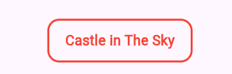

# Stateful Widgets
#@todo, in this chapter we will merge both card and make it interactive

So far, all our widgets have been `StatelessWidget` because they don't need to change after they're created. But interactive applications need widgets that can change their appearance based on user actions. That's where `StatefulWidget` comes in.

## What is State?

**State** is data that can change during the lifetime of a widget. Examples include:
- Whether a button has been pressed
- Whether a menu is open or closed
- Whether a film's details are showing or hidden
React has useState(), Vue usually uses Ref(), Angular has signals() and Flutter uses StatefulWidget

When state changes, the widget rebuilds to reflect the new state on screen. This automatic re-rendering of the UI is the concept of declarative programming.

## Ephemeral State vs App State

Not all state is the same:
- **Ephemeral state** (or UI state) affects only one widget and is temporary. Examples: whether a dropdown is expanded, whether a film's details are showing. This state doesn't need to be saved or shared globally.
- **App state** affects the entire application and persists. We'll cover this later with MVVM.

For now, we're focusing on **ephemeral state**—using `StatefulWidget` to manage local UI changes.

## Creating a StatefulWidget

A `StatefulWidget` is actually two classes:
1. The widget class itself (extends `StatefulWidget`)
2. A state class (extends `State<WidgetName>`)

The state class contains:
- The mutable data (properties that can change)
- The `build()` method that describes the UI
- Methods to modify the state (using `setState()`)

## Managing State with setState()

When you need to change state and update the UI, you call `setState()`:
- Pass a function that updates your state variables
- Flutter rebuilds the widget automatically
- The screen displays the new state

## Practice

Create a `FilmCard` widget that combines `FilmTitle()` and `FilmDetails()`:

1. **Make FilmCard a StatefulWidget** that accepts a `Film` object
   - Add a boolean state variable `showDetails` (initially false)
   - This tracks whether we're showing the title or details view

2. **Add tap interaction** using `GestureDetector`
   - Wrap your widget with `GestureDetector` and provide an `onTap` callback
   - In the callback, use `setState()` to toggle `showDetails`
   - Each tap switches between showing the title and the details

3. **Conditionally display different views**
   - If `showDetails` is false, show `FilmTitle(film: film)`
   - If `showDetails` is true, show `FilmDetails(film: film)`
   - Use a ternary operator to switch between them

4. **Style the container** to indicate it's interactive
   - Add padding, border, and width/height
   - The visual styling helps users understand they can tap

## Next Steps

This introduces local state management for interactivity. As your app grows, you'll learn about managing state at the application level using MVVM and Provider.  
