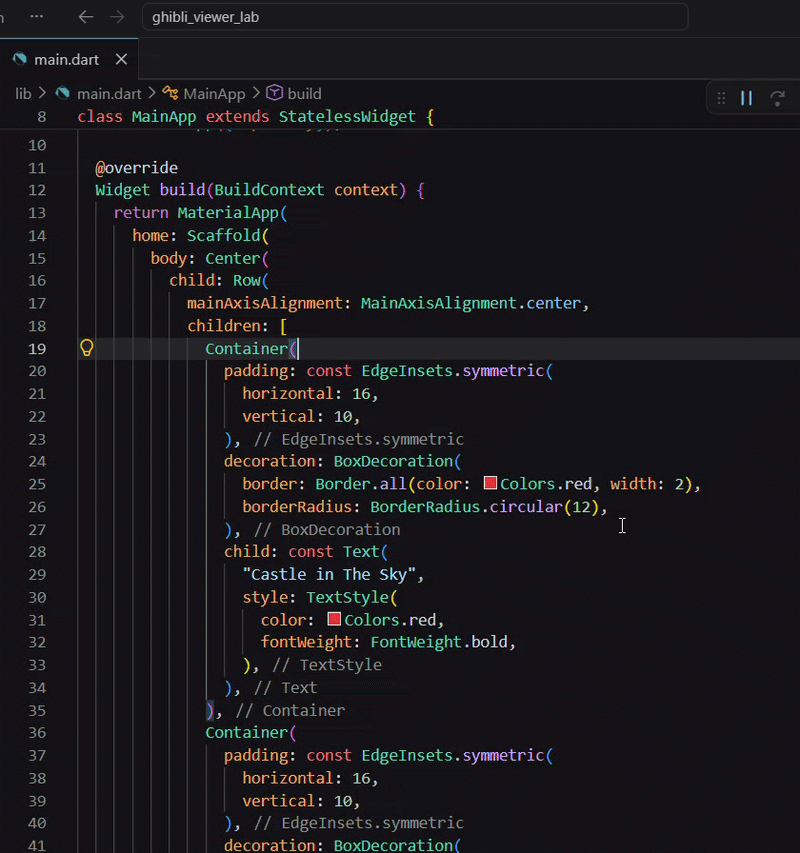

# Stateless Widgets

## Learning Outcome

By the end of this chapter, you'll understand the structure of StatelessWidget classes, learn constructor conventions, and create your first reusable custom widget called `FilmTitle` to eliminate code duplication.

## Theory / Explanation

Now that we know how to use the widgets provided by Flutter, let's see how to create our own widgets. We will start with **stateless** widgets.

A **StatelessWidget** is a Dart class that extends `StatelessWidget`.  

The following examples are taken from [Flutter's official documentation](https://api.flutter.dev/flutter/widgets/StatelessWidget-class.html#widgets.StatelessWidget.1)

## Simple StatelessWidget (No Parameters)

This is the most basic a widget can be:
- It is a Dart class
- It extends `StatelessWidget`
- It has a constructor
- It overrides the inherited `build()` method, that returns a `Widget`

```dart
class GreenFrog extends StatelessWidget {
  const GreenFrog({super.key});

  @override
  Widget build(BuildContext context) {
    return Container(color: const Color(0xFF2DBD3A));
  }
}
```

## StatelessWidget with Parameters

This is an example of a widget that takes parameters.  
Here the `color` attribute is used for styling and it has a default value specified in the constructor.  
The `child` attribute means that the `Frog()` widget can wrap around another widget.


```dart
class Frog extends StatelessWidget {
  const Frog({
    super.key,
    this.color = const Color(0xFF2DBD3A),
    this.child,
  });

  final Color color;
  final Widget? child;

  @override
  Widget build(BuildContext context) {
    return ColoredBox(color: color, child: child);
  }
}
```

### Usage

Once defined, you can use the `Frog` widget in different ways:

```dart
// Using default color (green)
const Frog()

// With a custom color
const Frog(color: Color(0xFFFF0000))

// With custom color and a child widget
const Frog(
  color: Color(0xFFFFFF00),
  child: Text("Yellow Frog"),
)
```

## Convention

By convention, widget constructors only use **named arguments** (in curly braces `{}`):
- **`super.key`** is always first
- **`child`** or **`children`** is always last (if present)
- Parameters are stored as `final` properties

## Practice

Let's now practice by extracting the UI logic we have created to display film titles.  
This step should result in a much cleaner `main.dart`:
```dart
// expected result by end of chapter
...

class MainApp extends StatelessWidget {
  const MainApp({super.key});

  @override
  Widget build(BuildContext context) {
    return MaterialApp(
      home: Scaffold(
        body: Center(
          child: Row(
            mainAxisAlignment: MainAxisAlignment.center,
            children: [
              const FilmTitle(title: "Castle in The Sky"),
              const FilmTitle(title: "Kiki's Delivery Service"),
            ],
          ),
        ),
      ),
    );
  }
}
```

### Exercise 1: Create a Reusable FilmTitle Widget

Create a FilmTitle widget to remove the duplicate code of `Container(Text())`:  
- Create a new folder in `lib` named `views`. In this folder, add a `film_title.dart` file
- Create a class `FilmTitle()` that extends `StatelessWidget`
- Add a `final String title` property
- In the `build()` method, return the previously defined `Container(Text())`
- Update the rest of the project to use this new widget to display film titles. The newly defined `FilmTitle()` widget must be imported in `main.dart`

<details>
<summary>Solution</summary>

#### lib/views/film_title.dart
```dart
// lib/views/film_title.dart
import 'package:flutter/material.dart';

class FilmTitle extends StatelessWidget {
  final String title;
  const FilmTitle({super.key, required this.title});

  @override
  Widget build(BuildContext context) {
    return Container(
      padding: const EdgeInsets.symmetric(horizontal: 10, vertical: 10),
      decoration: BoxDecoration(
        border: Border.all(color: Colors.red, width: 2),
        borderRadius: BorderRadius.circular(12),
      ),
      child: Text(
        title,
        style: const TextStyle(color: Colors.red, fontWeight: FontWeight.bold),
      ),
    );
  }
}
```

#### lib/main.dart
```dart
// lib/main.dart
import 'package:flutter/material.dart';
// You may need to adapt the import statement below
import 'package:flutter_lab_widget_to_layered_architecture/views/film_title.dart';

void main() {
  runApp(const MainApp());
}

class MainApp extends StatelessWidget {
  const MainApp({super.key});

  @override
  Widget build(BuildContext context) {
    return MaterialApp(
      home: Scaffold(
        body: Center(
          child: Row(
            mainAxisAlignment: MainAxisAlignment.center,
            children: [
              const FilmTitle(title: "Castle in The Sky"),
              const FilmTitle(title: "Kiki's Delivery Service"),
            ],
          ),
        ),
      ),
    );
  }
}
```
> [!Tip]
> The refactor tool can also be used to automatically extract code into a Widget.  
> However, the new Widget will appear in the current file and will not include the defined `title` parameter.
> 

</details>

## Recap

- ✓ Learned the anatomy of a StatelessWidget (class definition, constructor, build method)
- ✓ Understood constructor conventions (super.key first, child last, final properties)
- ✓ Created your first reusable custom widget (`FilmTitle`)
- ✓ Extracted common UI patterns to eliminate code duplication
- ✓ Practiced importing and using custom widgets

## Next Steps

So far, our `FilmTitle` displays only what was passed to it at creation time. In the next chapter, you'll learn about **Stateful Widgets**, which allow your widgets to manage and change state in response to user interaction—like toggling details on and off.
