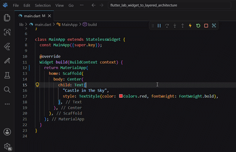
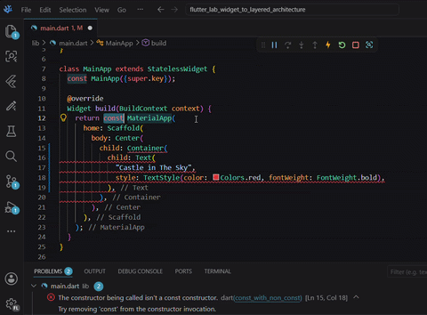
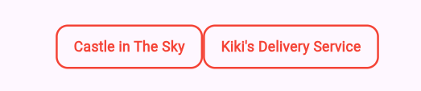

# Widgets Composition

Now that we know how to edit a simple widget, let us look into the use of widgets inside widgets.

### Understanding Widget Trees

In Flutter, widgets are organized in a hierarchical structure called a **widget tree**. Widgets can contain other widgets as children, creating nested layers that form your entire UI. This composition is the foundation of how applications are built in Flutter.

You can visualize your app's widget tree using the Flutter DevTools widget inspector. Open it to see how your widgets are nested.  
`MaterialApp` contains `Scaffold`, which contains `Center`, which contains `Text()`, and so on. This helps you understand the structure of your UI and debug layout issues.


### Widget Wrapping Patterns

The most common way widgets organize their children is through a `child:` parameter, like `Center()` wrapping a single widget:
```dart
        Center(
          child: Text(
            "Castle in The Sky",
            style: TextStyle(color: Colors.red, fontWeight: FontWeight.bold),
          ),
        ),
```

Some layout widgets also use `children:` (plural) to accept an array of widgets, like `Row()` and `Column()`.

Beyond these basic patterns, some widgets like `Scaffold()` use named parameters for specific purposes. For example, `Scaffold` provides `body:` for the main content, but it can also take other named parameters like `appBar:` or `floatingActionButton:` for different sections of the page. See [Scaffold class](https://api.flutter.dev/flutter/material/Scaffold-class.html) for an example.

### Practice
1. Add padding and border to the movie title:  
      

  The `Text()` widget cannot define padding and borders, we must use a `Container()` widget instead. The `Container()` will wrap around the `Text()`. Then the following attributes from `Container()` can be used to add the style we want:
  ```dart
      padding: const EdgeInsets.symmetric(horizontal: 16, vertical: 10),
  ```
  ```dart
      decoration: BoxDecoration(
        border: Border.all(color: Colors.red, width: 2),
        borderRadius: BorderRadius.circular(12),
      ),
  ```
  >[!TIP]
  >Updating widgets manually is not an easy task but the Flutter extension of your IDE can help you:  
  > **Right click** on `Text()` > select **"refactor"** > **"Wrap with Container"**   
  > The IDE will do the work for you.
  > 

  >[!TIP]
  >In Flutter you are likely to get this error  
  > `The constructor being called isn't a const constructor.`  
  > To fix it, simply use the IDE `Quick Fix` option, available when hovering the error:  
  > To learn more about this topic, see [Flutter performances best practices](https://docs.flutter.dev/perf/best-practices#control-build-cost) and [Dart Constructors](https://dart.dev/language/constructors) 
  > 
 

2. Duplicate your Movie Text using a `Row()` widget:  
   

  Currently our `Container(Text())` widget is child of `Center()`, and we want to have two `Container(Text())` instead of one. 
  ```dart
    body: Center(
            child: Text(
              "Castle in The Sky",
              style: TextStyle(color: Colors.red, fontWeight: FontWeight.bold),
            ),
          ),
  ```
  The solution is to add a `Row()` widget between `Center()` and `Container(Text())`. The `Row()` widget can take multiple widgets as children with the `children:` attribute.
  >[!TIP]
  >You can use the refactor tool to wrap with `Row()`

  `Row()` has a `mainAxisAlignment` parameters that has a default value of `MainAxisAlignment.start`. That makes its content glued to the left of the screen at this point of the exercise. You can override this default value by specifying `mainAxisAlignment: MainAxisAlignment.center,`

### Solution
```dart
import 'package:flutter/material.dart';

void main() {
  runApp(const MainApp());
}

class MainApp extends StatelessWidget {
  const MainApp({super.key});

  @override
  Widget build(BuildContext context) {
    return MaterialApp(
      home: Scaffold(
        body: Center(
          child: Row(
            mainAxisAlignment: MainAxisAlignment.center,
            children: [
              Container(
                padding: const EdgeInsets.symmetric(
                  horizontal: 16,
                  vertical: 10,
                ),
                decoration: BoxDecoration(
                  border: Border.all(color: Colors.red, width: 2),
                  borderRadius: BorderRadius.circular(12),
                ),
                child: const Text(
                  "Castle in The Sky",
                  style: TextStyle(
                    color: Colors.red,
                    fontWeight: FontWeight.bold,
                  ),
                ),
              ),
              Container(
                padding: const EdgeInsets.symmetric(
                  horizontal: 16,
                  vertical: 10,
                ),
                decoration: BoxDecoration(
                  border: Border.all(color: Colors.red, width: 2),
                  borderRadius: BorderRadius.circular(12),
                ),
                child: const Text(
                  "Kiki's Delivery Service",
                  style: TextStyle(
                    color: Colors.red,
                    fontWeight: FontWeight.bold,
                  ),
                ),
              ),
            ],
          ),
        ),
      ),
    );
  }
}

```
