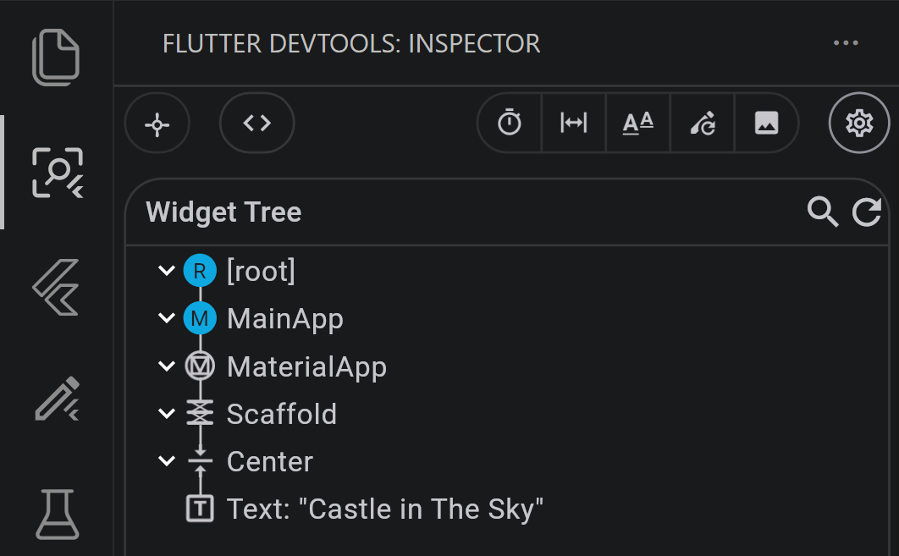
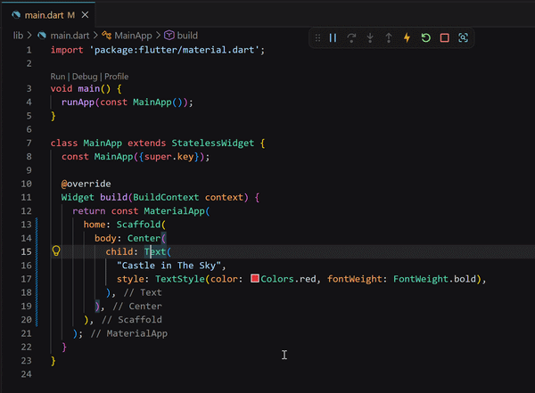
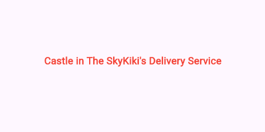
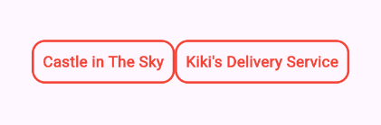

# Widgets Composition

Now that we know how to edit a simple widget, let us look into the use of widgets inside widgets.

### Understanding Widget Trees

In Flutter, widgets are organized in a hierarchical structure called a **widget tree**. Every widget can contain other widgets as children, creating nested layers that form your entire UI. This composition is the foundation of how applications are built in Flutter.

You can visualize your app's widget tree using the Flutter DevTools widget inspector. Open it to see how your widgets are nested—`MaterialApp` contains `Scaffold`, which contains `Center`, which contains `Text()`, and so on. This helps you understand the structure of your UI and debug layout issues.


### Widget Wrapping Patterns

The most common way widgets organize their children is through a `child:` parameter, like `Center()` wrapping a single widget:
```dart
        Center(
          child: Text(
            "Castle in The Sky",
            style: TextStyle(color: Colors.red, fontWeight: FontWeight.bold),
          ),
        ),
```

Some layout widgets also use `children:` (plural) to accept an array of widgets, like `Row()` and `Column()`.

Beyond these basic patterns, some widgets like `Scaffold()` use named parameters for specific purposes. For example, `Scaffold` provides `body:` for the main content, but it can also take other named parameters like `appBar:` or `floatingActionButton:` for different sections of the page. See [Scaffold class](https://api.flutter.dev/flutter/material/Scaffold-class.html) for an example.

### Practice
#@todo, border and padding before Row, to practice simple wrapping with container before seeing `children`?

1. Duplicate your Movie Text using a `Row()` widget:  

   Currently our `Text()` widget is child of `Center()`, and we want to have two `Text()` instead of one. The solution is to add a `Row()` widget between `Center()` and `Text()`:
   ```dart
    body: Center(
            child: Text(
              "Castle in The Sky",
              style: TextStyle(color: Colors.red, fontWeight: FontWeight.bold),
            ),
          ),
   ```
   >[!TIP]
   >Updating widgets manually is not an easy task but the Flutter extension of your IDE can help you.  
   > Right click on `Text()`, select "refactor" then "Wrap with Row" and the IDE will do the work for you.
   > 

   `Row()` has a `mainAxisAlignment` parameters that has a default value of `MainAxisAlignment.start`. That makes its content glued to the left of the screen at this point of the exercise. You can override this default value by specifying `mainAxisAlignment: MainAxisAlignment.center,`

   

2. Add padding and border to the movie titles `Text()`:  

   Wrap each movie title in a `Container()` to give them a border
   The result from the previous step does not look very good. We can refactor both `Text()` to be wrapped in a `Container()` to add some `padding` and `decoration` to display some borders
     

3. Refactor to extract a new custom `FilmTitle()` widget:

   Notice that we've duplicated the same `Container()` with `Text()` code twice. In software development, repeating the same code is generally a bad practice. Instead, we can create our own reusable widget called `FilmTitle()`.

  #@todo, link to documentation
   A custom widget is a Dart class that extends `StatelessWidget` and returns a widget in its `build()` method. By extracting the `Container()` and `Text()` logic into a custom widget, we can:
   - Avoid code duplication
   - Reuse the same widget multiple times
   - Make changes in one place if we need to update how movie titles look

   Since we want to display different movie titles, the `FilmTitle()` widget needs to accept a `title` parameter as input. This way, each `FilmTitle()` instance can display a different movie name.
   
   >[!TIP]
   >Your IDE can help with this too. Select the `Container()` code you want to extract, right-click, select "Refactor", then "Extract widget". The IDE will create a new widget class for you.
  
### Solution  
#@todo, hide by default
```dart
import 'package:flutter/material.dart';

void main() {
  runApp(const MainApp());
}

class MainApp extends StatelessWidget {
  const MainApp({super.key});

  @override
  Widget build(BuildContext context) {
    return MaterialApp(
      home: Scaffold(
        body: Center(
          child: Row(
            mainAxisAlignment: MainAxisAlignment.center,
            children: [
              FilmTitle(title: "Castle in The Sky"),
              FilmTitle(title: "Kiki's Delivery Service"),
            ],
          ),
        ),
      ),
    );
  }
}

class FilmTitle extends StatelessWidget {
  final String title;
  const new({super.key, required this.title});

  @override
  Widget build(BuildContext context) {
    return Container(
      padding: EdgeInsets.all(8),
      decoration: BoxDecoration(
        border: Border.all(color: Colors.red, width: 2),
        borderRadius: BorderRadius.circular(12),
      ),
      child: Text(
        title,
        style: TextStyle(color: Colors.red, fontWeight: FontWeight.bold),
      ),
    );
  }
}
```
