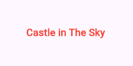

# Widgets Introduction

In Flutter, everything that appears on the screen, and dictate how it appears on the screens, is called a **Widget**. Widgets are Dart classes. Some are defined as part of the Flutter's <a href="https://docs.flutter.dev/ui/widgets/material" target="_blank">Material Components package</a>, and you can also create your own Widgets.

In the default empty project, there are already five widgets:
- `Text()`: A leaf widget that renders a String on the screen.
- `Center()`: A layout widget that forces its single child to be positioned in the middle of the available space.
- `Scaffold()`: Provides the fundamental visual structure for a page. It only renders the body in the current project, but a header (appBar) could be added.
- `MaterialApp()`: The root widget that initializes the application with <a href="https://docs.flutter.dev/ui/widgets/material" target="_blank">Material Components package</a>.
- `MainApp()`: The custom root widget defined in your code `class MainApp extends StatelessWidget`. Wraps the MaterialApp to start the widget tree.


```dart
import 'package:flutter/material.dart';

void main() {
  runApp(const MainApp());
}

class MainApp extends StatelessWidget {
  const MainApp({super.key});

  @override
  Widget build(BuildContext context) {
    return const MaterialApp(
      home: Scaffold(body: Center(child: Text('Hello World!'))),
    );
  }
}
```

### Practice
Now, let's apply this knowledge by customizing the interface. You will update the text content to display a movie title and apply basic styling to match the design below:  
    


1. Change the `String` parameter passed to the `Text()` widget and save the change to see the application hot reload to show the changes.
2. `Text()` can take optional arguments in the form of `key: value`. Add a second parameter `style: TextStyle()` and complete `TextStyle()` to change the color and font weight.

    >[!TIP] 
    >You don't need to memorize properties. Before typing, hover over TextStyle in your IDE to see all available parameters. Then, inside the parentheses, start typing color or fontWeight and let auto-completion guide you.  


### Solution
#@todo, hide by default

```dart

          child: Text(
            "Castle in The Sky",
            style: TextStyle(color: Colors.red, fontWeight: FontWeight.bold),
          ),
     
```
Note on Types: As per the documentation, color expects a Color object, not a string. You can provide this in two ways:

- Predefined Constants: `Colors.red` or `Colors.blue`
- Custom Values: Create a specific color using `Color(0xFFE63946)` for hex, or `Color.fromRGBO(230, 57, 70, 1)` for RGB

Similarly, fontWeight expects a FontWeight enum (e.g., `FontWeight.w400`, `FontWeight.w700`, `FontWeight.bold`), not a string or number.
